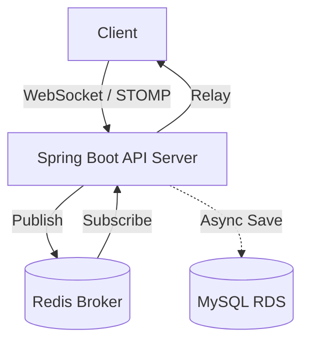

# 🔮 Tarot Insight (타로 인사이트)

> **"분산 환경의 실시간 통신과 고정밀 동시성 제어를 보장하는 타로 상담 플랫폼"**

**Tarot Insight**는 사용자와 타로 상담사를 실시간으로 연결하는 전문 상담 플랫폼입니다. 최신 **Spring Boot 4.0** 환경을 기반으로 하며, **Redisson 분산 락**을 통한 동시성 제어와 **비동기 채팅 저장 아키텍처**를 통해 대규모 트래픽에서도 안정적인 서비스를 제공합니다.

---

## 1. 🛠 핵심 기술적 성취 (Technical Focus)

본 프로젝트는 백엔드 설계의 핵심인 **실시간성, 확장성, 그리고 정합성**을 해결하는 데 집중했습니다.

* **고가용성 동시성 제어 (Redisson):** Redis 기반 분산 락을 구현하여 1:1 상담 예약의 중복 발생을 원천 차단. **100인 동시 요청 테스트**를 통해 정합성 검증 완료.
* **비동기 성능 최적화 (Asynchronous):** 메시지 발송(Websocket)과 DB 저장 쓰레드를 분리. 사용자에게 즉각적인 응답을 제공하면서 무거운 I/O 작업은 백그라운드에서 처리하도록 설계.
* **실시간 메시징 인프라 (Pub/Sub):** 다중 서버 확장(Scale-out)을 고려하여 Redis를 메시지 브로커로 활용. 서버 간 세션 공유 없이도 끊김 없는 실시간 채팅 환경 구축.
* **최신 프레임워크 최적화 (Spring Boot 4.0):** 라이브러리 호환성 이슈 해결 및 보안이 강화된 최신 Redis 직렬화 전략(RedisSerializer.json) 적용.

---

## 2. 💻 Tech Stack

### Backend
* **Core:** Java 17, **Spring Boot 4.0.3**
* **Concurrency:** **Redisson (Distributed Lock)**, **Spring @Async (ThreadPool)**
* **Data:** Spring Data JPA, QueryDSL, MySQL 8.0
* **Real-time:** WebSocket, STOMP, Redis Pub/Sub
* **Security:** Spring Security, JWT, BCrypt

---

## 3. 🏗 System Architecture

---

## 4. 🚀 Core Features & Implementation

### 4.1 Redisson 기반 분산 예약 로직
* **Facade Pattern:** 서비스 로직과 락 로직을 분리. 트랜잭션 시작 전 락을 획득하고 커밋 후 해제하여 안정적인 동시성 제어 수행.

### 4.2 지능형 채팅 시스템
* **Persistence:** 휘발성 웹소켓 메시지를 MySQL에 실시간 영속화. 채팅방 입장 시 과거 내역을 로드하는 History API 제공.
* **Pub/Sub Bridge:** 다중 인스턴스 환경에서도 메시지 유실 방지를 위해 Redis 수신 컨테이너 수동 설정.

### 4.3 성능 중심의 비동기 저장 구조
* **Thread Isolation:** `ThreadPoolTaskExecutor`를 커스터마이징하여 `ChatAsync-X` 전용 쓰레드 풀 운용. DB 쓰기 지연이 실시간 채팅 전송에 영향을 주지 않도록 격리.

---

## 5. 🚨 Troubleshooting (문제 해결 경험)

### 5.1 Spring Boot 4.0 & Redisson 자동 설정 충돌
* **Issue:** 프레임워크 버전 업그레이드 후 Redisson 스타터의 자동 설정 경로 오류 발생.
* **Solution:** 스타터 자동 설정을 제외하고 `RedissonClient`를 직접 Java Config로 수동 등록하여 호환성 확보.

### 5.2 보안 중심의 Redis 직렬화 전략
* **Issue:** `GenericJackson2JsonRedisSerializer`의 보안 취약점 및 Deprecated 대응 필요.
* **Solution:** `RedisSerializer.json()` 도입 및 `ObjectMapper` Bean 분리 관리를 통해 날짜/시간 포맷 정합성 해결.

### 5.3 동기식 DB 저장으로 인한 채팅 성능 저하 해결
* **Issue:** 메시지 발행 전 DB 저장을 수행하는 동기(Sync) 방식에서 DB 부하 시 채팅 응답 속도가 느려지는 병목 현상 확인.
* **Solution:** 컨트롤러의 저장 책임을 제거하고, `RedisSubscriber`가 메시지를 수신하는 즉시 사용자 전송과 비동기(@Async) 저장을 동시에 수행하도록 아키텍처 개선.

---

## 6. 🗄 Database Design

* **`chat_messages`**: 실시간 대화 데이터 영속화 및 타입 관리
* **`consultation_reservation`**: 분산 락 키 및 낙관적 락(Version) 관리
* **`tarot_reader`**: 상담사 프로필 및 실시간 평점 집계 관리

---
*Last Updated: 2026.03.09*