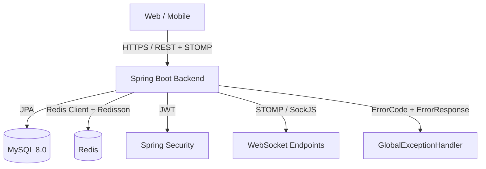

# 🔮 Tarot Insight Backend

> **JWT 인증·실시간 상담·정교한 예약/랭킹/타로 콘텐츠까지 구현한 “실전형 타로 상담 플랫폼” 백엔드입니다.**  
> 신입 백엔드 개발자로서 대기업/중견 수준의 설계·구현 역량을 보여주기 위해, 인증/인가–예약 동시성–실시간 통신–정규화된 타로 콘텐츠까지 한 번에 담았습니다.

---

## 1. 프로젝트 개요

### 1.1 한 줄 요약

- **“사용자–타로 상담사 매칭 + 예약/취소 + 실시간 채팅 + 테마별 타로 리딩”을 지원하는 백엔드 모노리식 API 서버**
- **Spring Boot 4.0 + JPA + Redis + WebSocket + JWT** 기반으로, 실서비스에 가까운 요구사항을 신입 수준에서 끝까지 설계·구현한 것이 목표입니다.

### 1.2 주요 도메인 시나리오

- **사용자 시스템**
  - 회원가입 / 로그인 (JWT 발급, 액세스/리프레시 + 블랙리스트)
  - 사용자 프로필 관리
- **타로 리딩**
  - 랜덤 카드 뽑기 및 카드 의미 조회
  - **테마별 타로 콘텐츠 (연애/취업/승진/금전/건강/대인관계/오늘의 운세)** 정규화 설계
  - 타로 리딩 결과 저장 및 히스토리 조회
- **타로 상담 (Reservation)**
  - 상담사 목록 / 랭킹 / 검색 (isActive 및 평점 기반)
  - 1:1 상담 예약 및 **Redisson 분산 락 기반 중복 예약 방지**
  - **예약 취소(당일 취소 불가, 24시간 전까지만 허용)** 및 슬롯 재오픈
- **실시간 상담**
  - WebSocket(STOMP) 기반 1:1 채팅
  - 상담 종료 후 채팅 기록 저장
- **리뷰/랭킹**
  - 상담 리뷰 작성 및 평점 관리
  - Redis ZSet 기반 **실시간 상담사 랭킹** + Warm-up(서버 재시작 시 랭킹 복구)

---

## 2. Tech Stack

### 2.1 Backend

- **Language & Framework**
  - Java 17
  - Spring Boot 4.0.3 (WebMVC, Data JPA, Security, Validation, WebSocket, Actuator)
- **Database & Persistence**
  - MySQL 8.0 (InnoDB)
  - Spring Data JPA + QueryDSL 6.9 (동적 검색, 커스텀 조회)
- **Caching & Messaging**
  - Redis (랭킹 ZSet, 토큰 저장/블랙리스트, 캐시)
  - Redisson 3.44.0 (분산 락)
- **Auth & Security**
  - Spring Security 7.x
  - JJWT 0.12.x (Access/Refresh 토큰, 서명 및 만료 관리)
- **Others**
  - Springdoc OpenAPI 3.0.2 (Swagger UI)
  - Lombok, Spring Boot Actuator, Micrometer

### 2.2 Test & Quality

- JUnit 5, Spring Boot Test, Spring Security Test
- **MockMvc 통합 테스트**
  - 인증/인가(401/403)와 DTO 검증(400) 케이스 포함
  - 핵심 API 위주로 성공/실패 시나리오 자동 검증

---

## 3. 아키텍처 개요

### 3.1 전체 구조



### 3.2 패키지 구조 (요약)

- `global.config` : `SecurityConfig`, `RedisConfig`, `QueryDslConfig`, `RankingWarmUpRunner`, `TarotDataInitializer` 등
- `global.security` : `JwtTokenProvider`, `JwtAuthenticationFilter` 등 JWT 기반 인증/인가
- `global.error` : `ErrorCode`, `ErrorResponse`, `BusinessException`, `GlobalExceptionHandler`
- `domain.user` : 사용자/인증 (회원가입, 로그인, 토큰 재발급)
- `domain.reader` : 상담사 엔티티, 랭킹, 검색, `isActive` 운영 플래그
- `domain.reservation` : 상담 예약/취소, 동시성 제어
- `domain.tarot` : 카드/테마/덱/해석 엔티티 및 테마별 타로 리딩 서비스
- `domain.review` : 상담 리뷰 및 평점
- `domain.chat` : WebSocket 채팅 및 Redis Pub/Sub

---

## 4. 주요 기능별 설계/구현 포인트

### 4.1 인증·인가 (JWT + Role 기반 Security)

- `SecurityConfig`에서 **엔드포인트별 인가 규칙을 명확히 분리**:
  - `permitAll`: 회원가입/로그인, 건강 체크, Swagger 등
  - `hasRole('USER')`: 일반 사용자 기능 (타로 리딩, 예약 생성/취소, 리뷰 작성 등)
  - `hasRole('READER')`: 상담사 전용 기능 (자신의 스케줄/예약 조회 등)
  - `hasRole('ADMIN')`: 운영자 전용 (상담사 리스트(Admin 뷰), isActive 토글 등)
- `JwtAuthenticationFilter`로 매 요청 시 토큰 검증 및 `SecurityContext` 설정
- Redis를 이용해 **Refresh 토큰 및 블랙리스트(로그아웃/강제만료)** 관리

### 4.2 DTO 검증 + 전역 에러 응답 규격

- `jakarta.validation` 기반 DTO 검증
  - `@NotNull`, `@NotBlank`, `@Size`, `@Pattern`, `@Min`, `@Max` 등 **요청 DTO에 일관 적용**
  - 컨트롤러 단에서 `@Valid` 사용
- `GlobalExceptionHandler` (`@RestControllerAdvice`)에서 다음 예외들을 표준화:
  - `BusinessException` (도메인 규칙 위반)
  - `MethodArgumentNotValidException` (필드 검증 실패)
  - JSON 파싱/형변환 예외 등
- 응답 모델: `ErrorResponse`
  - `status`, `code`, `message` + `errors`(필드별 에러 리스트)
  - 내부 스택트레이스나 민감 정보는 노출하지 않고, **클라이언트가 바로 이해할 수 있는 한글 메시지** 제공

### 4.3 상담사 도메인: isActive / 랭킹 / 검색

- `TarotReader` 엔티티에 `isActive` 필드 도입
  - **활성 상담사만**:
    - 사용자/상담사용 상담사 목록 조회
    - 랭킹/검색/예약 대상
  - 관리자 전용 API를 통해 `isActive` 토글
- Redis ZSet 기반 랭킹:
  - 예약/리뷰 데이터로 점수 계산 후 ZSet 업데이트
  - `RankingWarmUpRunner`가 서버 기동 시 MySQL에서 데이터를 읽어 **Redis 랭킹을 재구축** (재시작에도 랭킹 손실 없음)

### 4.4 예약 도메인: 24시간 전까지만 취소 + 동시성 제어

- 예약 엔티티 `ConsultationReservation`:
  - `reader`, `user`, `reservationTime`, `status`, `version`(낙관적 락) 등
- **예약 취소 규칙**
  - 예약 시간 기준 24시간 이내인 경우 취소 불가 (`BusinessException` 발생)
  - 취소 시:
    - 상태를 `CANCELLED` 등으로 변경
    - 해당 타임슬롯을 다시 예약 가능하도록 스케줄에서 해제
- **Redisson 분산 락 적용**
  - 동일 상담사/시간대 예약 시도에 대해 **분산 락 + 트랜잭션** 조합으로 중복 예약 차단
  - 락 획득 실패 시 명확한 에러 코드로 응답

### 4.5 테마별 타로 콘텐츠 정규화 설계

- DB 정규화 구조:
  - `tarot_theme` : 테마 마스터 (연애운/취업운/금전운/건강운/대인관계/오늘의 운세 등, `theme_code` + `theme_name`)
  - `tarot_deck` : 덱 마스터 (Romantic Tarot, Universal Waite, …)
  - `tarot_cards` : 카드 마스터 (0~77번 메이저/마이너 아르카나, `card_no` + 기본 이름/이미지)
  - `tarot_interpretation` : **(테마, 덱, 카드)** 조합별 해석 텍스트
- `card_data.sql`:
  - `tmp_tarot_results` 임시 테이블에 방대한 원본 데이터를 INSERT
  - 앱 기동 시 자동 실행되며, 아래 마이그레이션 쿼리로 정규화 테이블을 채움:
    - `tarot_theme` / `tarot_deck` / `tarot_cards` / `tarot_interpretation`에 `INSERT … SELECT` 수행
  - 임시 테이블은 세션 종료 시 자동 삭제 → **정규화된 4개 테이블만 실제 스키마에 남음**
- `TarotThemeService`:
  - `TarotInterpretationRepository`를 통해 테마별/일별 타로 결과를 조회
  - **테마 ID + 카드 ID + 덱 ID 조합**으로 “같은 카드라도 테마에 따라 다른 해석”을 제공

### 4.6 실시간 상담 (WebSocket + Redis Pub/Sub)

- STOMP 기반 WebSocket 엔드포인트:
  - 클라이언트는 `/ws` 엔드포인트로 접속 후, 특정 채널(방) 구독
  - 메시지 전송 시 Redis Pub/Sub를 통해 확장성을 고려한 구조
- 상담 종료 시 채팅 기록을 DB 또는 별도 저장소에 영속화 (상담 이력 조회에 활용 가능)

---

## 5. 테스트 전략 (MockMvc 기반 통합 테스트)

- Spring MVC + Security 필터를 포함한 **통합 테스트(MockMvc)** 작성
  - **인증 실패(401)**: 토큰 미포함/만료/위조 케이스
  - **인가 실패(403)**: 권한 없는 역할(USER/READER/ADMIN 혼동)로 보호 리소스 접근
  - **검증 실패(400)**: DTO Bean Validation 위반 케이스
- 최소한의 “대표 시나리오”에 집중:
  - 로그인 후 보호 API 호출
  - 예약 생성/취소, 타로 리딩, 상담사 목록 조회 등 핵심 도메인에 대한 happy path + failure path 검증

---

## 6. 실행 방법 (Backend 단독)

### 6.1 환경 변수

- `application.yml` 예시:
  - MySQL: `jdbc:mysql://localhost:3306/tarot_db`
  - Redis: `localhost:6379`
  - JWT: `jwt.secret`, `jwt.access-token-validity`, `jwt.refresh-token-validity` 등

### 6.2 실행

```bash
cd tarot-insight-backend

# 의존성 다운로드 및 빌드
./gradlew clean build

# 애플리케이션 실행
./gradlew bootRun
```

서버 기동 시:

- `card_data.sql`이 자동으로 실행되어
  - `tarot_theme`, `tarot_deck`, `tarot_cards`, `tarot_interpretation`
  에 타로 콘텐츠가 채워집니다.
- `RankingWarmUpRunner`가 MySQL 데이터를 기반으로 Redis 랭킹을 복원합니다.

Swagger UI:

- `http://localhost:8080/swagger-ui/index.html`

---

## 7. 신입 백엔드 포트폴리오로서의 포인트

- **실제 서비스에 가까운 요구사항**을 끝까지 구현
  - 단순 CRUD가 아니라, **예약 동시성, 롤 기반 인가, isActive 운영 플래그, 24시간 취소 제한, 정규화/마이그레이션**까지 포함
- **운영을 고려한 설계**
  - 서버 재시작 시에도 동작이 깨지지 않도록 Redis 랭킹 Warm-up, SQL 스크립트 자동 초기화
  - 전역 에러 응답 규격으로 클라이언트/프론트엔드 개발자 경험 개선
- **테마별 타로 콘텐츠 정규화**를 통해
  - 단순 토이 데이터가 아니라, **카드 78장 × 여러 테마 × 여러 덱** 조합을 설계 차원에서 소화
  - 포트폴리오 설명 시 “DB 설계 역량”을 보여줄 수 있는 강한 근거가 됩니다.

> 이 백엔드는 **“혼자서도 실서비스에 가까운 백엔드 한 벌을 처음부터 끝까지 설계·구현할 수 있다”** 는 것을 보여주기 위한 프로젝트입니다.  
> 프론트엔드와 함께 전체 플로우를 시연하면, 사용자 입장에서 **“정말 쓸 수 있는 서비스”** 에 가깝게 느껴지도록 구성했습니다.
