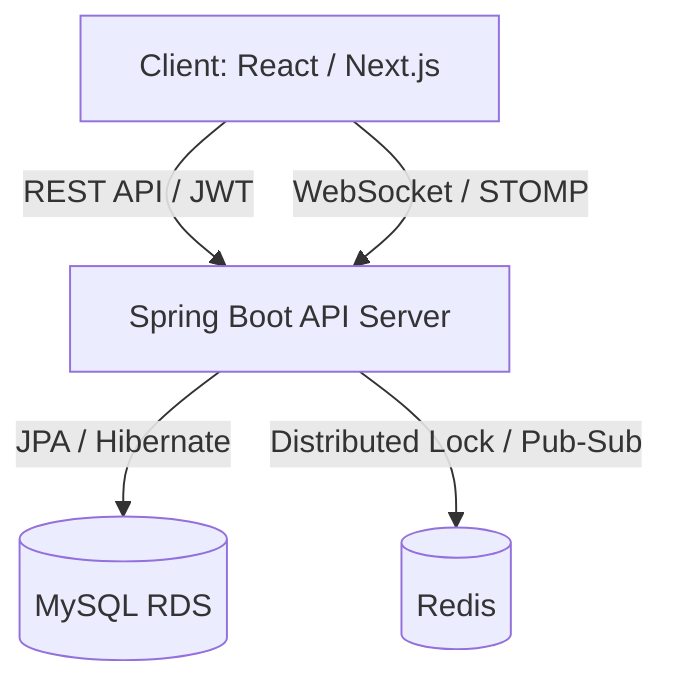

# 🔮 Tarot Insight (타로 인사이트)

> **"분산 환경의 실시간 통신과 고정밀 동시성 제어를 보장하는 타로 상담 플랫폼"**

**Tarot Insight**는 사용자와 타로 상담사를 실시간으로 연결하는 전문 상담 플랫폼입니다. 최신 **Spring Boot 4.0** 환경을 기반으로 하며, **Redisson 분산 락**을 도입하여 대규모 동시 요청 상황에서도 데이터 무결성을 완벽하게 보장합니다.

---

## 1. 🛠 핵심 기술적 성취 (Technical Focus)

본 프로젝트는 백엔드 설계의 핵심인 **실시간성, 확장성, 그리고 정합성**을 해결하는 데 집중했습니다.

* **고가용성 동시성 제어 (Redisson):** 특정 시간대 상담 예약이 몰리는 상황을 대비하여 Redis 기반 분산 락을 구현. **100인 동시 요청 테스트**를 통해 중복 예약을 원천 차단함을 검증.
* **실시간 메시징 인프라 (Pub/Sub):** 다중 서버 확장(Scale-out)을 고려하여 Redis를 메시지 브로커로 활용. 서버 간 세션 공유 없이도 끊김 없는 실시간 채팅 환경 구축.
* **최신 프레임워크 최적화 (Spring Boot 4.0):** 프레임워크 버전 업에 따른 라이브러리 호환성 이슈를 수동 Bean 설정 및 최신 직렬화 전략(RedisSerializer.json)으로 해결.
* **테스트 자동화 및 무결성:** 외래키(FK) 제약 조건을 고려한 데이터 정제 로직과 동적 ID 할당 테스트를 통해 '깨지지 않는 테스트 환경' 구축.

---

## 2. 💻 Tech Stack

### Backend
* **Core:** Java 17, **Spring Boot 4.0.3**
* **Concurrency:** **Redisson (Distributed Lock)**
* **Data:** Spring Data JPA, QueryDSL, MySQL 8.0
* **Real-time:** WebSocket, STOMP, Redis Pub/Sub
* **Security:** Spring Security, JWT, BCrypt

### Infrastructure
* **Container:** Docker
* **Storage & Cache:** Redis, MySQL

---

## 3. 🏗 System Architecture

---

## 4. 🚀 Core Features & Implementation

### 4.1 Redisson 기반 분산 예약 로직
* **Facade Pattern:** 서비스 로직과 락 로직을 분리하기 위해 `ReservationFacade` 계층 신설. 트랜잭션 시작 전 락을 획득하고, 커밋 후 락을 해제하여 안정적인 동시성 제어 수행.
* **Atomic Reservation:** 상담사 ID와 예약 시간을 조합한 고유 키로 락을 생성하여 동일 시간대 중복 예약 방지.

### 4.2 지능형 채팅 시스템
* **Persistence:** 휘발성 웹소켓 메시지를 MySQL에 실시간 영속화. 채팅방 입장 시 과거 내역을 로드하는 History API 제공.
* **Pub/Sub Bridge:** `RedisMessageListenerContainer`를 수동 설정하여 다중 인스턴스 환경에서도 메시지 유실 방지.

---

## 5. 🚨 Troubleshooting (문제 해결 경험)

### 5.1 Spring Boot 4.0 & Redisson 자동 설정 충돌
* **Issue:** Spring Boot 4.x로 마이그레이션 중 Redisson 스타터가 내부 `RedisAutoConfiguration` 경로를 찾지 못해 서버 기동 실패.
* **Solution:** 스타터의 자동 설정을 제외(`exclude`)하고, `RedissonClient` 및 관련 인프라(ObjectMapper, RedisTemplate)를 직접 Java Config로 수동 등록하여 호환성 확보.

### 5.2 보안 중심의 Redis 직렬화 전략
* **Issue:** `GenericJackson2JsonRedisSerializer`가 보안 취약점 문제로 Spring 4.0에서 Deprecated됨.
* **Solution:** 특정 구현 클래스에 의존하지 않는 `RedisSerializer.json()` 팩토리 메서드를 도입. `ObjectMapper`를 별도 Bean으로 관리하여 날짜/시간(JavaTimeModule) 포맷 정합성 해결.

### 5.3 테스트 생명주기 내 외래키 제약 조건 해결
* **Issue:** 동시성 테스트 후 데이터 초기화 시 `ConsultationReservation`을 참조하는 `Review` 데이터로 인해 SQL 삭제 에러 발생.
* **Solution:** `@AfterEach` 내 삭제 순서를 '자식(Review) -> 부모(Reservation)' 순으로 명시적으로 재배치하여 테스트 안정성 100% 확보.

---

## 6. 🗄 Database Design

* **`chat_messages`**: 실시간 대화 데이터 영속화
* **`consultation_reservation`**: 분산 락 키 및 버전 관리
* **`tarot_reader`**: 상담사 프로필 및 실시간 평점 관리

---
*Last Updated: 2026.03.09*