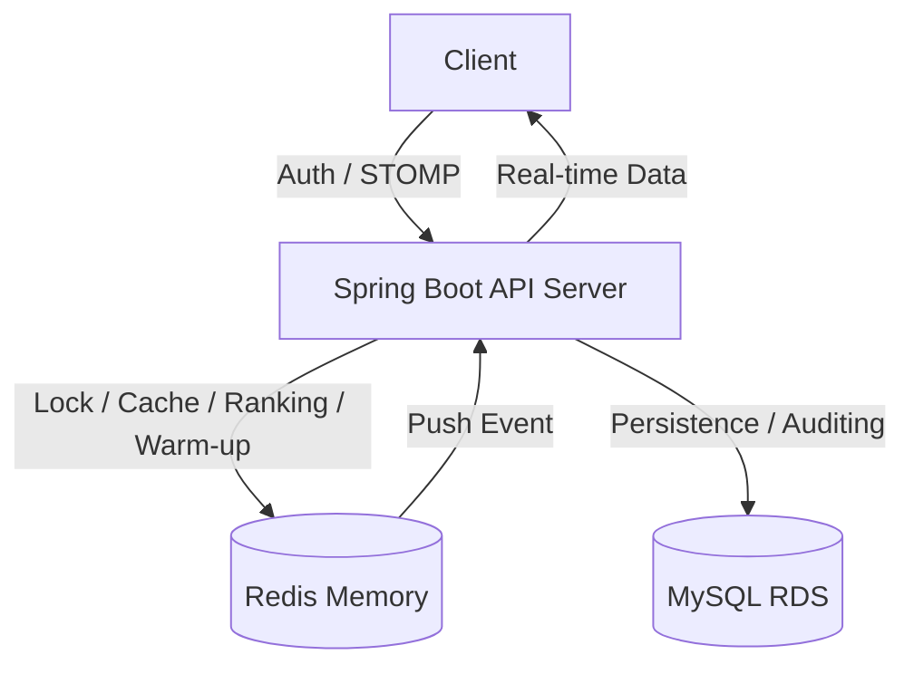

# 🔮 Tarot Insight (타로 인사이트)

> **"분산 환경의 실시간 통신, 고정밀 동시성 제어, 그리고 완벽한 데이터 회복 탄력성을 보장하는 타로 상담 플랫폼"**

**Tarot Insight**는 사용자와 타로 상담사를 실시간으로 연결하는 전문 상담 플랫폼입니다. 최신 **Spring Boot 4.0** 환경에서 **Redisson 분산 락**, **Redis 실시간 기술**, 그리고 **WebSocket(STOMP)**을 결합하여 대규모 트래픽에서도 데이터 정합성과 생동감 있는 사용자 경험을 보장합니다.

---

## 1. 🛠 핵심 기술적 성취 (Technical Focus)

* **시스템 회복 탄력성 (Warm-up System):** 서버 재시작 시 Redis(인메모리) 데이터 증발에 대비하여, `ApplicationRunner`를 통해 MySQL의 영속 데이터를 기반으로 랭킹 점수를 자동 복구하는 안정성 확보.
* **실시간 양방향 통신 (WebSocket & STOMP):** 랭킹 변동 이벤트를 감지하여 구독 중인 전 유저에게 실시간 알림을 브로드캐스트하는 Event-Driven 아키텍처 구현.
* **고성능 실시간 랭킹 (Redis ZSet):** Redis의 Sorted Set을 활용하여 복잡한 DB 정렬 쿼리 없이 **O(log N)** 성능으로 실시간 인기 차트 산출.
* **고가용성 동시성 제어 (Redisson):** Redis 기반 분산 락을 통해 1:1 상담 예약의 중복 발생을 차단하고, **100인 멀티쓰레드 테스트**로 정합성 검증 완료.
* **지능형 동적 검색 (QueryDSL):** `BooleanExpression`을 활용한 상담사 필터링 및 **Fetch Join**을 통한 N+1 문제 해결로 조회 성능 최적화.
* **보안 고도화 (Refresh Token Rotation):** JWT 기반 보안 체계에 RTR 전략을 도입하여 토큰 탈취 위험 방어 및 Redis 블랙리스트 기반 로그아웃 처리.

---

## 2. 💻 Tech Stack

### Backend
* **Core:** Java 17, **Spring Boot 4.0.3**
* **Real-time:** **WebSocket (STOMP)**, SockJS
* **Concurrency & Cache:** **Redisson (Lock)**, **Redis (Ranking/Cache)**, Spring Cache
* **Data:** Spring Data JPA, **QueryDSL 6.9**, MySQL 8.0
* **Security:** Spring Security, **JWT (Access/Refresh with Rotation)**, BCrypt, Redis Blacklist

---

## 3. 🏗 System Architecture

---

## 4. 🚀 Core Features & Implementation

### 4.1 Redis 기반 실시간 자동 복구 랭킹
* **Startup Warm-up:** 서버 기동 시점에 DB 예약 건수를 집계하여 Redis 점수를 자동 갱신. 서버 장애 후에도 데이터 연속성 보장.
* **Event-Driven UI:** 예약 성공 시점에 랭킹 점수를 가산하고, 동시에 WebSocket 채널(`/sub/ranking`)로 최신 TOP 5 리스트를 브로드캐스트.

### 4.2 Redisson 분산 예약 시스템
* **Distributed Lock:** Facade 패턴으로 트랜잭션과 락의 주기를 분리하여 커밋 시점의 데이터 정합성 보장.

### 4.3 QueryDSL 동적 필터링
* **Custom Repository:** 닉네임, 경력, 평점 등 다양한 검색 조건을 지원하는 고성능 동적 쿼리 엔진 구축.

---

## 5. 🚨 Troubleshooting (문제 해결 경험)

### 5.1 Warm-up 과정 중 LazyInitializationException
* **Issue:** 서버 기동 시 예약 데이터를 읽어 Redis에 적재할 때, 세션 종료로 인한 상담사/유저 정보 참조 에러 발생.
* **Solution:** `ApplicationRunner` 구현체에 `@Transactional(readOnly = true)`를 적용하여 데이터 집계가 완료될 때까지 영속성 컨텍스트를 유지하여 해결.

### 5.2 분산 락 환경에서의 트랜잭션 커밋 타이밍 이슈
* **Issue:** 100인 동시성 테스트 시 간헐적으로 중복 데이터 발생.
* **Solution:** 락 해제 전 `flush()` 호출을 강제하여 DB 반영 시점과 락 소유 시점을 일치시켜 정합성 확보.

### 5.3 WebSocket 경로 설정 오류
* **Issue:** 서버 전송 경로와 클라이언트 구독 경로 불일치로 실시간 알림 미작동.
* **Solution:** `/sub` 브로커 경로 체계를 통일하고 클라이언트 SockJS 설정을 수정하여 실시간 통신 성공.

---

## 🗄 Database Design

* **`users`**: 사용자 신원 및 권한(UserRole) 관리
* **`tarot_readers`**: 상담사 프로필 및 실시간 인기도 집계
* **`consultation_reservation`**: 예약 상태 관리 및 분산 락의 정합성 기준점
* **`review`**: 서비스 품질 데이터 및 캐시 무효화(Evict) 트리거

---
*Last Updated: 2026.03.11*