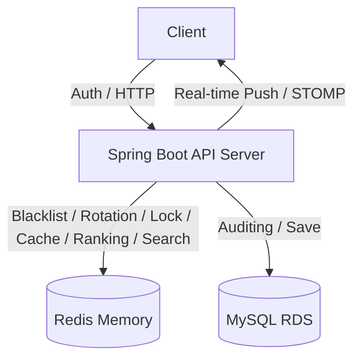

# 🔮 Tarot Insight (타로 인사이트)

> **"분산 환경의 실시간 통신, 고정밀 동시성 제어, 그리고 완벽한 데이터 정합성을 보장하는 타로 상담 플랫폼"**

**Tarot Insight**는 사용자와 타로 상담사를 실시간으로 연결하는 전문 상담 플랫폼입니다. 최신 **Spring Boot 4.0** 환경을 기반으로 하며, **Redisson 분산 락**, **Redis 실시간 기술(ZSet/Cache)**, 그리고 **WebSocket(STOMP)** 알림 체계를 결합하여 대규모 트래픽에서도 안정적이고 생동감 있는 서비스를 제공합니다.

---

## 1. 🛠 핵심 기술적 성취 (Technical Focus)

본 프로젝트는 백엔드 설계의 핵심인 **실시간성, 확장성, 정합성, 그리고 보안**을 해결하는 데 집중했습니다.

* **실시간 양방향 통신 (WebSocket & STOMP):** 랭킹 변동 시 모든 접속 유저에게 실시간 알림을 푸시하는 브로드캐스트 환경 구축. `/pub`, `/sub` 구조를 통한 메시지 브로커 최적화.
* **실시간 랭킹 시스템 (Redis ZSet):** Redis의 Sorted Set을 활용하여 예약 발생 시 실시간으로 상담사 순위를 산출. **O(log N)**의 성능으로 대규모 유저에게 실시간 인기 차트 제공.
* **고가용성 동시성 제어 (Redisson):** Redis 기반 분산 락을 구현하여 1:1 상담 예약의 중복 발생을 원천 차단. **100인 멀티쓰레드 테스트**를 통해 정합성 검증 완료.
* **지능형 동적 검색 (QueryDSL):** 복잡한 상담사 필터링 기능을 `BooleanExpression` 조각으로 구현하여 유연성 극대화 및 **Fetch Join을 통한 N+1 문제 원천 차단.**
* **성능 및 데이터 정합성 보장 (Cache-Aside & Evict):** 상담사 목록에 Redis 캐시를 적용하여 응답 속도를 극대화하고, 리뷰 작성 시 `@CacheEvict`를 통해 캐시와 DB 간의 정합성 유지.
* **보안 고도화 (Refresh Token Rotation):** Access Token의 짧은 수명을 보완하기 위해 RTR(Rotation) 전략 도입. 재발급 시마다 Refresh Token을 갱신하여 토큰 탈취 위험 방어.

---

## 2. 💻 Tech Stack

### Backend
* **Core:** Java 17, **Spring Boot 4.0.3**
* **Real-time:** **WebSocket (STOMP)**, SockJS
* **Concurrency & Cache:** **Redisson (Distributed Lock)**, **Redis Sorted Set (Ranking)**, Spring Cache
* **Data:** Spring Data JPA, **QueryDSL 6.9 (Custom Repository Pattern)**, MySQL 8.0
* **Security:** Spring Security, **JWT (Access/Refresh with Rotation)**, BCrypt, Redis Blacklist
* **Docs:** Springdoc OpenAPI 3.0.2 (Swagger UI)

---

## 3. 🏗 System Architecture

---

## 4. 🚀 Core Features & Implementation

### 4.1 실시간 랭킹 및 WebSocket 알림
* **Event-Driven Update:** 예약 생성 성공 시점에 `TarotReaderRankingService`를 호출하여 Redis ZSet 점수 자동 가산.
* **Broadcast:** 점수 갱신 즉시 `/sub/ranking` 채널을 구독 중인 모든 클라이언트에게 최신 TOP 5 목록을 전송하여 새로고침 없는 순위 변동 구현.

### 4.2 Redisson 분산 예약 및 리뷰 캐싱
* **Distributed Lock:** Facade 패턴을 활용하여 트랜잭션과 락의 생명주기를 분리. **Redisson Watchdog**을 활용해 작업 완료 시까지 락 유지 보장.

### 4.3 QueryDSL 기반 지능형 필터링
* **Custom Repository:** 인터페이스와 구현체(`Impl`)를 분리하는 정석 패턴 적용.
* **Dynamic Query:** 닉네임, 경력, 평점 등 복합 필터를 지원하며 `fetchJoin`을 통해 조회 성능 최적화.

---

## 5. 🚨 Troubleshooting (문제 해결 경험)

### 5.1 WebSocket 브로커 경로 불일치 이슈
* **Issue:** 서버에서 메시지를 전송했으나 클라이언트가 수신하지 못하는 현상 발생.
* **Solution:** `WebSocketConfig`에 설정된 브로커 접두사(`/sub`)와 서비스 레이어의 전송 경로가 불일치함을 확인. `/sub/ranking`으로 경로를 통일하여 해결.

### 5.2 분산 락 환경에서의 트랜잭션 커밋 타이밍 이슈
* **Issue:** 100인 동시성 테스트 시 간헐적으로 중복 예약이 발생하는 현상 확인.
* **Solution:** 락 해제 전 DB 반영을 보장하기 위해 서비스 레이어에서 `flush()` 호출 및 Redisson Watchdog 활성화로 정합성 100% 확보.

### 5.3 QueryDSL QClass 관리 및 인식 문제
* **Issue:** 빌드 환경에 따른 자동 생성 클래스(QClass) 충돌 및 인텔리제이 미인식.
* **Solution:** `build.gradle` 설정 및 `.gitignore`에 `src/main/generated/` 추가하여 클린 코드 관리.

---

## 🗄 Database Design

* **`users`**: 사용자 정보, 권한(UserRole), 암호화된 비밀번호(BCrypt) 관리
* **`tarot_readers`**: 상담사 프로필, 실시간 평점 및 활성화 상태 관리
* **`consultation_reservation`**: 예약 상태 및 분산 락 관리
* **`review`**: 상담 서비스 품질 관리 및 캐시 무효화 트리거

---
*Last Updated: 2026.03.11*