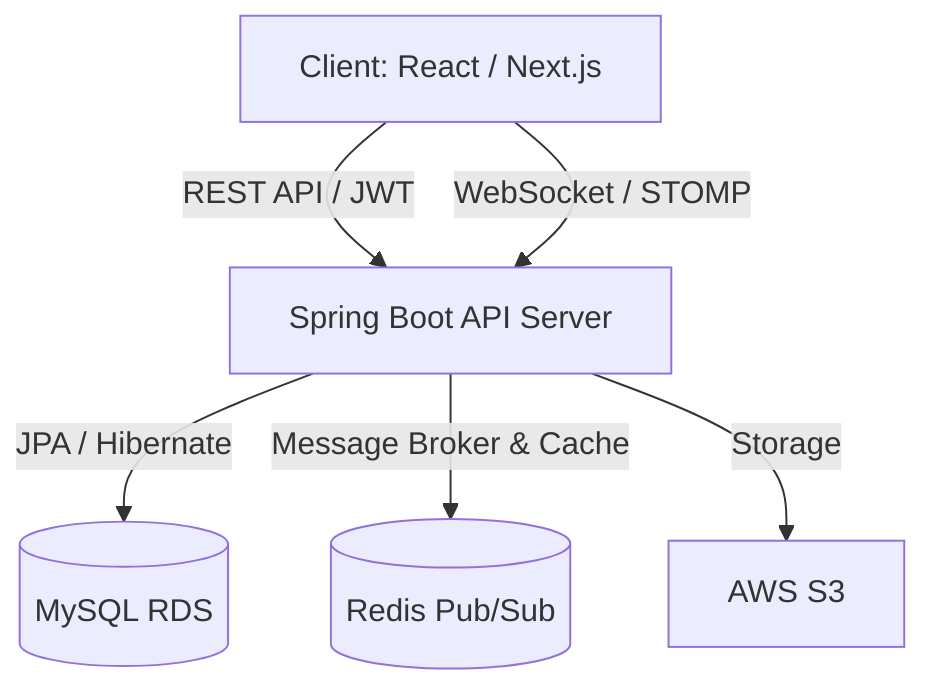

# 🔮 Tarot Insight (타로 인사이트)

> **"분산 환경의 실시간 통신과 데이터 정합성을 보장하는 온라인 타로 상담 플랫폼"**

**Tarot Insight**는 단순한 운세 풀이를 넘어, 사용자와 타로 상담사를 실시간으로 연결하는 전문 상담 플랫폼입니다. 다중 서버 확장을 고려한 **Redis Pub/Sub** 기반 채팅과, **JPA 낙관적 락**을 통한 예약 동시성 제어, 그리고 **데이터 영속화(Persistence)**를 통해 신뢰성 있는 상담 환경을 구축했습니다.

---

## 1. 🛠 핵심 기술적 성취 (Technical Focus)

이 프로젝트는 백엔드 개발자로서 직면할 수 있는 실무적 난제들을 기술적으로 해결하는 데 집중했습니다.

* **실시간 데이터 영속화:** WebSocket으로 오가는 휘발성 메시지를 MySQL에 실시간 저장하고, 재접속 시 REST API를 통해 이전 대화를 완벽히 복구하는 로직 설계.
* **분산 환경 확장성:** 서버 메모리가 아닌 Redis를 Message Broker로 활용하여, 서버 인스턴스가 늘어나도 세션 공유 및 실시간 통신이 끊기지 않는 구조 구축.
* **보안 및 통신 제어:** Spring Security와 CORS 설정을 최적화하여 웹소켓 핸드셰이크와 API 요청 간의 보안 충돌 해결.
* **데이터 무결성:** 인기 상담사 예약 시 발생하는 동시성 이슈를 낙관적 락(Optimistic Lock)으로 제어하여 중복 예약 원천 차단.

---

## 2. 💻 Tech Stack

### Backend
* **Core:** Java 17, Spring Boot 3.4.x
* **Security:** Spring Security, JWT, BCrypt
* **Data:** Spring Data JPA, QueryDSL, MySQL 8.0
* **Real-time:** WebSocket, STOMP, SockJS, **Redis**

### Infrastructure
* **Container & Broker:** Docker, Redis Pub/Sub
* **Cloud (Target):** AWS (EC2, RDS, S3)

---

## 3. 🏗 System Architecture

---

## 4. 🚀 Core Features & Implementation

### 4.1 지능형 실시간 채팅 시스템
* **TALK/ENTER 구분 로직:** 시스템 메시지(입장)와 실제 대화(TALK)를 구분하여 필터링. 실제 상담 기록만 DB에 저장함으로써 데이터베이스 부하를 줄이고 데이터 효율성 제고.
* **History API:** 채팅방 입장 시 `/api/chat/room/{roomId}` API를 호출하여 과거 상담 내역을 시간순으로 복구.

### 4.2 동시성 제어가 적용된 예약 시스템
* **Optimistic Locking:** `@Version` 필드를 활용하여 동일한 상담사에게 동시에 예약이 몰릴 경우 최초 요청자만 승인하고 나머지는 안전하게 예외 처리.

### 4.3 비즈니스 자동화 (Review & Rating)
* **평점 실시간 집계:** 사용자가 리뷰를 작성하면 별도의 스케줄러 없이 즉시 상담사 테이블의 평균 점수(AVG)를 갱신하도록 설계.

---

## 5. 🚨 Troubleshooting (문제 해결 경험)

### 5.1 Spring Security와 웹소켓/API 간 간섭 해결
* **Issue:** 시큐리티 활성화 시 REST API 호출은 401 에러, 웹소켓은 403 에러로 연결이 차단됨.
* **Solution:** `SecurityFilterChain`을 커스텀하여 웹소켓 엔드포인트 및 API 경로에 대한 접근 권한을 정밀하게 설정하고, 포트 번호가 다른 테스트 환경을 위해 CORS(Cross-Origin Resource Sharing) 설정을 빈(Bean)으로 등록하여 해결.

### 5.2 MySQL Safe Update 모드 충돌
* **Issue:** 대량의 테스트 데이터를 삭제(DELETE)하는 과정에서 기본키가 아닌 컬럼 조건 사용 시 에러 발생.
* **Solution:** `SET SQL_SAFE_UPDATES = 0;` 명령을 통해 세션 단위에서 안전 모드를 일시 해제하여 대규모 데이터 정제 작업 수행.

### 5.3 데이터 역직렬화 및 Type 누락 이슈
* **Issue:** DB 저장 시 메시지 타입(TALK/ENTER) 정보가 유실되어 화면 렌더링에 오류 발생.
* **Solution:** JPA Entity 설계 시 `@Enumerated(EnumType.STRING)`을 적용하고, Service 계층에서 Builder 패턴을 통해 DTO의 타입을 엔티티로 확실히 매핑하여 정합성 확보.

---

## 6. 🗄 Database Design (ERD Summary)

* **`chat_messages`**: 채팅 영속화 테이블 (roomId, sender, message, type, createdAt)
* **`consultation_reservation`**: 예약 정합성 관리 (version 컬럼 포함)
* **`tarot_reader`**: 상담사 실시간 평점 관리 (rating 필드)

---

## 📈 Future Improvements
* **메시지 비동기 처리:** 메시지 저장 로직을 비동기(Async)로 전환하여 채팅 전송 속도 극대화.
* **S3 연동:** 상담 중 타로 카드 이미지 및 프로필 사진 업로드 기능 추가.

---
*최종 업데이트: 2026.03.08*