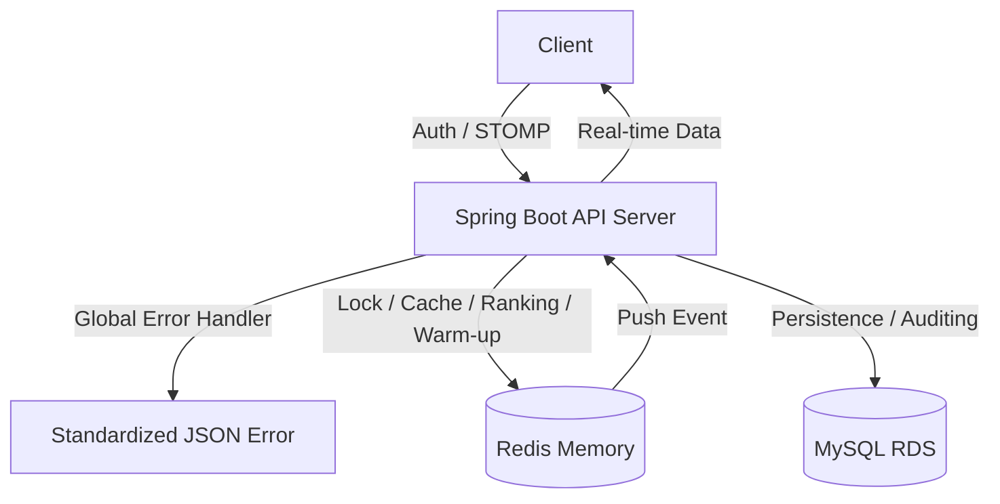

# 🔮 Tarot Insight (타로 인사이트)

> **"분산 환경의 실시간 통신, 고정밀 동시성 제어, 그리고 완벽한 에러 관제 시스템을 보장하는 타로 상담 플랫폼"**

**Tarot Insight**는 사용자와 타로 상담사를 실시간으로 연결하는 전문 상담 플랫폼입니다. 최신 **Spring Boot 4.0** 환경에서 **Redisson 분산 락**, **Redis 실시간 기술**, 그리고 **WebSocket(STOMP)**을 결합하여 대규모 트래픽에서도 데이터 정합성과 생동감 있는 사용자 경험을 보장합니다.

---

## 1. 🛠 핵심 기술적 성취 (Technical Focus)

* **전역 예외 관제 시스템 (Global Error Handling):** `@RestControllerAdvice`와 커스텀 `BusinessException`을 도입하여 시스템 전역의 에러를 일관된 규격(Status, Code, Message)으로 응답하도록 설계. 보안 강화 및 UX 향상.
* **시스템 회복 탄력성 (Warm-up System):** 서버 재시작 시 Redis 데이터 증발에 대비하여 `ApplicationRunner`를 통해 MySQL의 영속 데이터를 기반으로 랭킹 점수를 자동 복구하는 안정성 확보.
* **실시간 양방향 통신 (WebSocket & STOMP):** 랭킹 변동 이벤트를 감지하여 구독 중인 전 유저에게 실시간 알림을 브로드캐스트하는 Event-Driven 아키텍처 구현.
* **고성능 실시간 랭킹 (Redis ZSet):** Redis의 Sorted Set을 활용하여 복잡한 DB 정렬 쿼리 없이 **O(log N)** 성능으로 실시간 인기 차트 산출.
* **고가용성 동시성 제어 (Redisson):** Redis 기반 분산 락을 통해 1:1 상담 예약의 중복 발생을 차단하고, **100인 멀티쓰레드 테스트**로 정합성 검증 완료.
* **보안 고도화 (Refresh Token Rotation):** JWT 기반 보안 체계에 RTR 전략을 도입하여 토큰 탈취 위험 방어 및 Redis 블랙리스트 기반 로그아웃 처리.

---

## 2. 💻 Tech Stack

### Backend
* **Core:** Java 17, **Spring Boot 4.0.3**
* **Real-time:** **WebSocket (STOMP)**, SockJS
* **Concurrency & Cache:** **Redisson (Lock)**, **Redis (Ranking/Cache)**, Spring Cache
* **Data:** Spring Data JPA, **QueryDSL 6.9**, MySQL 8.0
* **Security:** Spring Security, **JWT (Access/Refresh with Rotation)**, Redis Blacklist
* **Global Error:** **@RestControllerAdvice**, Custom BusinessException, ErrorCode(Enum)

---

## 3. 🏗 System Architecture

---

## 4. 🚀 Core Features & Implementation

### 4.1 전역 예외 처리 및 비즈니스 예외
* **Centralized Control:** 모든 컨트롤러에서 발생하는 예외를 `GlobalExceptionHandler`에서 가로채어 보안 노출을 방지하고 일관된 에러 코드(`R002`, `D001` 등)를 반환.
* **BusinessException:** 단순 `RuntimeException` 대신 서비스 특화 예외를 사용하여 로직의 가독성과 처리 효율 증대.

### 4.2 Redis 기반 실시간 자동 복구 랭킹
* **Startup Warm-up:** 서버 기동 시점에 DB 예약 건수를 집계하여 Redis 점수를 자동 갱신. 서버 장애 후에도 데이터 연속성 보장.

### 4.3 Redisson 분산 예약 시스템
* **Distributed Lock:** Facade 패턴으로 트랜잭션과 락의 주기를 분리하여 커밋 시점의 데이터 정합성 보장.

---

## 5. 🚨 Troubleshooting (문제 해결 경험)

### 5.1 BusinessException 생성자 타입 불일치 이슈
* **Issue:** `new BusinessException(ErrorCode.ENUM)` 호출 시 생성자가 `String` 타입을 요구하여 컴파일 에러 발생.
* **Solution:** `BusinessException` 클래스에 `ErrorCode` Enum을 직접 받는 생성자를 추가하고, 관제탑에서 해당 Enum의 Status와 Code를 동적으로 추출하도록 구조 개선.

### 5.2 날짜 형식 파싱 에러(DateTimeParseException)와 예외 전파
* **Issue:** 사용자 입력 시간이 규격(`ISO-8601`)과 다를 때 500 에러 발생 및 StackTrace 노출.
* **Solution:** `GlobalExceptionHandler`에 최상위 `Exception.class` 핸들러를 구축하여 500 에러를 `C003` 코드로 캡슐화하고, 향후 특정 예외(DateTimeParseException)를 개별 핸들링할 수 있는 확장성 확보.

### 5.3 Warm-up 과정 중 LazyInitializationException
* **Issue:** 서버 기동 시 예약 데이터를 읽어 Redis에 적재할 때 세션 종료 에러 발생.
* **Solution:** `ApplicationRunner` 구현체에 `@Transactional(readOnly = true)`를 적용하여 영속성 컨텍스트 유지.

---

## 🗄 Database Design

* **`users`**: 사용자 신원 및 권한 관리
* **`tarot_readers`**: 상담사 프로필 및 실시간 인기도 집계
* **`consultation_reservation`**: 예약 상태 관리 및 분산 락의 정합성 기준점
* **`review`**: 서비스 품질 데이터 및 캐시 무효화 트리거

---
*Last Updated: 2026.03.11*