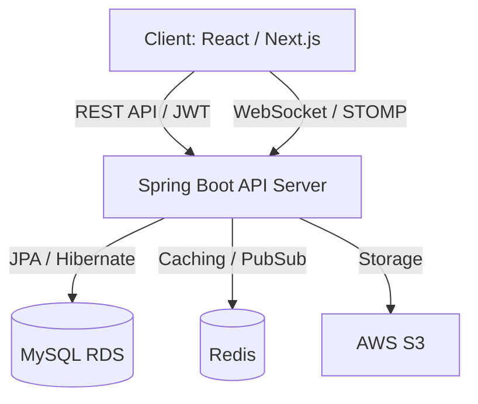

# 🔮 Tarot Insight (타로 인사이트)

> **"실시간 소통으로 깊이를 더하는 온라인 타로 상담 플랫폼"**

**Tarot Insight**는 단순한 운세 풀이를 넘어, 사용자와 타로 상담사를 실시간으로 연결하는 전문 상담 플랫폼입니다. 고성능 웹소켓 통신과 정교한 예약 시스템을 결합하여 실제 대면 상담에 가까운 사용자 경험을 제공합니다.

---

## 1. 🛠 Project Overview

### 주요 목표
- **실시간 상담 시스템:** WebSocket(STOMP)을 활용한 딜레이 없는 양방향 상담 구현.
- **예약 무결성 보장:** 동시성 제어를 통해 예약 중복 및 데이터 정합성 문제 해결.
- **데이터 자동화:** 리뷰 등록 시 상담사 평점을 실시간(AVG)으로 집계 및 반영.
- **확장성 설계:** Redis 기반 캐싱 및 세션 관리를 고려한 서비스 구조 설계.

---

## 2. 💻 Tech Stack

### Backend
- **Core:** Java 17, Spring Boot 3.4.x
- **Security:** Spring Security, JWT (Stateless 인증)
- **Data:** Spring Data JPA, QueryDSL, MySQL 8.0
- **Real-time:** WebSocket, STOMP, SockJS

### Infrastructure (Target)
- **Cloud:** AWS (EC2, RDS, S3)
- **Container:** Docker
- **Cache/Session:** Redis

---

## 3. 🏗 System Architecture



---

## 4. 🚀 Core Features

### 4.1 User System
- **JWT 기반 인증:** 무상태(Stateless) 인증 체계를 통한 보안 강화 및 확장성 확보.
- **RBAC:** 사용자와 상담사(Reader) 권한 분리를 통한 메뉴 및 API 접근 제어.

### 4.2 Tarot Card Reading
- **무작위 추출 알고리즘:** 78장의 타로 카드 중 중복 없는 무작위 리딩 기능 구현.
- **히스토리 관리:** 질문과 리딩 결과를 영구 저장하여 개인별 운세 변화 추적 가능.

### 4.3 Consultation & Reservation
- **실시간 예약 신청:** 상담사별 스케줄 기반 유연한 예약 및 취소 프로세스.
- **데이터 정합성:** 예약 시점의 상태 검증 및 낙관적 락을 통한 중복 예약 방지.

### 4.4 Real-time Chatting
- **양방향 통신:** SockJS와 STOMP를 연동하여 안정적인 채팅 환경 구축.
- **대화 영속화:** 모든 메시지를 `chat_messages` 테이블에 실시간 저장하여 상담 히스토리 보존.

### 4.5 Review & Rating System (핵심 기능)
- **평점 자동 업데이트:** 리뷰 등록 시 상담사의 전체 평점을 실시간(AVG)으로 재계산 (예: 4.3333점).
- **자동 상태 전환:** 리뷰 작성이 완료되면 예약 상태가 자동으로 `COMPLETED`로 변경되어 상담 사이클 종료.

---

## 5. 🗄 Database Design (ERD)

### 5.1 User / Reader System
- **`user`**: id(PK), email, password, nickname, role, timestamps.
- **`tarot_reader`**: id(PK), user_id(FK), profile, experience_year, **rating(Double)**, is_active.

### 5.2 Tarot Reading System
- **`tarot_card`**: id(PK), name, description, image_url.
- **`tarot_reading`**: id(PK), user_id(FK), tarot_card_id(FK), question, result_text, created_at.

### 5.3 Reservation / Chat / Review
- **`consultation_reservation`**: id(PK), user_id(FK), reader_id(FK), time, **status(RESERVED, COMPLETED)**, **version**.
- **`chat_message`**: id(PK), reservation_id(FK), sender_id, message, created_at.
- **`review`**: id(PK), reservation_id(FK), user_id(FK), reader_id(FK), **rating(int)**, comment.

---

## 6. 🔌 API Design

### 🔑 Auth
- `POST /api/auth/signup` : 회원가입
- `POST /api/auth/login` : 로그인 (JWT 발급)

### 🔮 Tarot & Reader
- `GET /api/tarot/random` : 랜덤 카드 리딩 및 결과 반환
- `GET /api/readers` : 활성화된 상담사 목록 조회 (평점순 정렬 지원)

### 📅 Reservation & Review
- `POST /api/reservations` : 상담 예약 (낙관적 락 적용)
- `GET /api/reservations/my` : 내 예약 현황 리스트 조회
- `POST /api/reviews` : 상담 후기 등록 및 상담사 평점 실시간 갱신

### 💬 Chat (WebSocket)
- **Endpoint:** `/ws-tarot` (SockJS 연결)
- **Publish:** `/pub/chat/message`
- **Subscribe:** `/sub/chat/room/{reservationId}`

---

## ⚡ 7. Redis Usage (Planned)
- **Cache:** 상담사 목록 및 타로 카드 메타데이터 캐싱을 통한 DB I/O 부하 감소.
- **Pub/Sub:** 분산 서버 환경에서 WebSocket 세션 공유 및 메시지 브로드캐스트 지원.

---

## 🛡️ 8. Concurrency Handling (동시성 제어)

상담 예약 시 발생할 수 있는 동일 시간 중복 예약 문제를 방지하기 위해 JPA의 **낙관적 락(Optimistic Lock)**을 적용했습니다.

```java
@Version
private Long version;
```

트랜잭션 충돌 시 발생하는 `ObjectOptimisticLockingFailureException`을 핸들링하여 데이터 무결성을 보장합니다.

---

## ☁️ 9. Deployment (Planned)

- **AWS EC2:** Spring Boot 애플리케이션 서버 배포 및 운영.
- **AWS RDS:** MySQL 데이터베이스 관리 및 다중 가용 영역(Multi-AZ) 백업 설정.
- **Docker:** 일관된 런타임 환경 보장을 위한 컨테이너화 및 배포 자동화.

---

## 📈 10. Future Improvements (향후 과제)

- **실시간 알림 서비스:** 예약 시간 10분 전 자동 알림 기능 구현 (SSE 또는 FCM 연동).
- **이미지 업로드 시스템:** AWS S3를 활용한 고해상도 타로 카드 및 프로필 이미지 관리.
- **상담 통계 대시보드:** 상담사별 매출 관리 및 사용자 만족도 변화 추이 시각화 제공.

---

## 🎯 11. Key Points (핵심 역량)

- **실시간 데이터 제어:** WebSocket/STOMP 환경에서 딜레이 없는 데이터 통신 및 메시지 영속화 로직 설계.
- **데이터 정합성 보장:** 동시성 이슈를 고려한 안정적인 예약 및 비즈니스 프로세스 구축.
- **비즈니스 자동화:** 리뷰와 평점, 예약 상태를 유기적으로 연결하여 운영 효율을 극대화함.

---
*최종 업데이트: 2026.03.08*