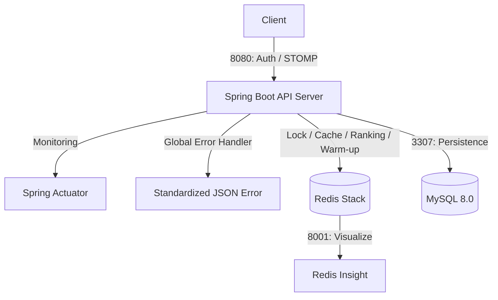

# 🔮 Tarot Insight (타로 인사이트) - Backend

> **"분산 환경의 실시간 통신, 고정밀 동시성 제어, 그리고 완벽한 에러 관제 시스템을 보장하는 타로 상담 플랫폼"**

**Tarot Insight**는 사용자와 타로 상담사를 실시간으로 연결하는 전문 상담 플랫폼입니다. 최신 **Spring Boot 4.0** 환경에서 **Redisson 분산 락**, **Redis 실시간 기술**, 그리고 **WebSocket(STOMP)**을 결합하여 대규모 트래픽에서도 데이터 정합성과 생동감 있는 사용자 경험을 보장합니다.

---

## 1. 🛠 핵심 기술적 성취 (Technical Focus)

* **인프라 컨테이너화 (Dockerizing):** 전체 시스템을 Docker Compose로 오케스트레이션하여 환경 의존성 제거. 특히 로컬 DB와의 포트 충돌을 방지하기 위한 **포트 포워딩(3307:3306)** 및 컨테이너 간 가상 네트워크 구축.
* **전역 예외 관제 시스템 (Global Error Handling):** `@RestControllerAdvice`와 커스텀 `BusinessException`을 도입하여 시스템 전역의 에러를 일관된 규격(Status, Code, Message)으로 응답하도록 설계.
* **시스템 회복 탄력성 (Warm-up System):** 서버 재시작 시 Redis 데이터 증발에 대비하여 `ApplicationRunner`를 통해 MySQL 데이터를 기반으로 랭킹 점수를 자동 복구하는 안정성 확보.
* **실시간 양방향 통신 (WebSocket & STOMP):** 랭킹 변동 이벤트를 감지하여 구독 중인 전 유저에게 실시간 알림을 브로드캐스트하는 Event-Driven 아키텍처 구현.
* **고가용성 동시성 제어 (Redisson):** Redis 기반 분산 락을 통해 1:1 상담 예약의 중복 발생을 차단하고, Facade 패턴을 적용하여 트랜잭션과 락의 주기를 분리.
* **운영 지표 가시화 (Spring Actuator):** `/actuator/health` 및 `/prometheus` 엔드포인트를 노출하여 서버의 상태와 성능 지표를 실시간 모니터링 가능하도록 구현.

---

## 2. 💻 Tech Stack

### Backend
* **Core:** Java 17, **Spring Boot 4.0.3**
* **Real-time:** **WebSocket (STOMP)**, SockJS
* **Concurrency & Cache:** **Redisson (Lock)**, **Redis (Ranking/Cache)**
* **Data:** Spring Data JPA, QueryDSL 6.9, MySQL 8.0
* **Infrastructure:** **Docker**, **Docker Compose**, **Redis Stack**
* **Monitoring:** **Spring Boot Actuator**, Micrometer

---

## 🏗 System Architecture

---

## 🚀 Core Features & Implementation

### 3.1 Docker 기반 독립 인프라
* **Port Mapping:** 로컬 MySQL(3306)과의 충돌을 피하기 위해 호스트 포트를 **3307**로 맵핑하여 개발 환경의 독립성 확보.
* **Health Check & Restart:** MySQL의 초기화 지연으로 인한 앱 기동 실패를 방지하기 위해 `restart: on-failure` 정책 적용.

### 3.2 분산 환경 설정 최적화
* **Network Awareness:** Redisson 설정 시 `localhost`가 아닌 도커 서비스명(`redis`)을 호스트로 사용하도록 `@Value`를 통한 동적 주입 처리.

---

## 🚨 Troubleshooting (문제 해결 경험)

### 5.1 Docker 환경 변수 매핑(Relaxed Binding) 이슈
* **Issue:** Redisson이 도커 환경에서 `127.0.0.1`로 접속을 시도하여 연결 실패.
* **Solution:** 도커 컴포즈의 환경 변수명(`SPRING_DATA_REDIS_HOST`)과 자바 코드의 `@Value` 매핑 이름을 일치시켜 서비스명(`redis`)을 정확히 인식하도록 수정.

### 5.2 MySQL 부팅 지연으로 인한 App Crash
* **Issue:** 컨테이너 실행 시 DB 준비 전 앱이 먼저 접속을 시도하여 종료됨.
* **Solution:** `depends_on` 설정과 더불어 도커 컴포즈의 `restart` 정책을 강화하여 DB가 준비될 때까지 앱이 스스로 재시작하며 대기하도록 개선.

### 5.3 포트 점유(Bind Exception) 해결
* **Issue:** 로컬 PC의 MySQL이 3306 포트를 사용 중이라 컨테이너 구동 불가.
* **Solution:** 외부 노출 포트(Host Port)만 3307로 변경하고, 컨테이너 내부 통신은 3306을 유지하여 코드 수정 없이 인프라 설정만으로 문제 해결.

---
*Last Updated: 2026.03.11*