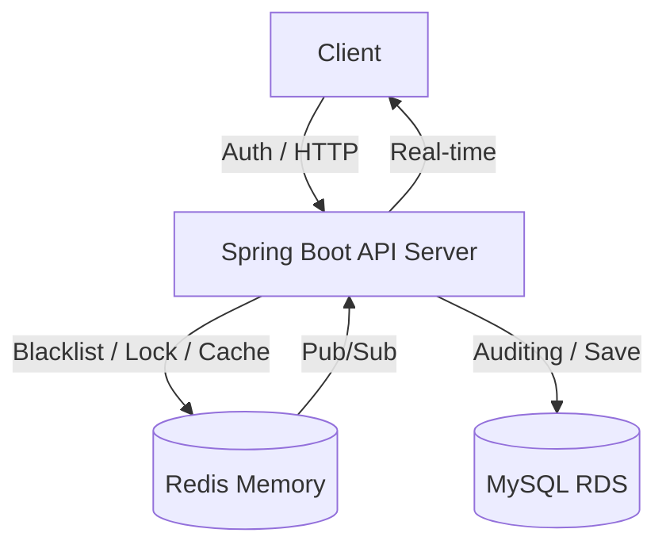

# 🔮 Tarot Insight (타로 인사이트)

> **"분산 환경의 실시간 통신, 고정밀 동시성 제어, 그리고 완벽한 데이터 정합성을 보장하는 타로 상담 플랫폼"**

**Tarot Insight**는 사용자와 타로 상담사를 실시간으로 연결하는 전문 상담 플랫폼입니다. 최신 **Spring Boot 4.0** 환경을 기반으로 하며, **Redisson 분산 락**, **Redis 캐싱**, 그리고 **JWT 블랙리스트** 보안 체계를 결합하여 대규모 트래픽에서도 안정적이고 안전한 서비스를 제공합니다.

---

## 1. 🛠 핵심 기술적 성취 (Technical Focus)

본 프로젝트는 백엔드 설계의 핵심인 **실시간성, 확장성, 정합성, 그리고 보안**을 해결하는 데 집중했습니다.

* **고가용성 동시성 제어 (Redisson):** Redis 기반 분산 락을 구현하여 1:1 상담 예약의 중복 발생을 원천 차단.
* **성능 및 데이터 정합성 보장 (Cache-Aside & Evict):** 상담사 목록에 Redis 캐시를 적용하여 응답 속도를 극대화하고, 리뷰 작성 시 `@CacheEvict`를 통해 캐시와 DB 간의 100% 정합성 유지.
* **Stateless 보안 강화 (JWT Logout Blacklist):** JWT의 한계를 극복하기 위해 Redis 블랙리스트를 도입. 로그아웃된 토큰을 남은 유효시간 동안 Redis에 저장하여 즉각적인 접근 차단 구현.
* **도메인 주도 설계 (DDD) 및 최적화:** 도메인별 패키지 분리 및 내부 Enum 독립화를 통해 유지보수성 향상. `BaseTimeEntity` 상속 구조로 전 엔티티의 JPA Auditing 통일.

---

## 2. 💻 Tech Stack

### Backend
* **Core:** Java 17, **Spring Boot 4.0.3**
* **Concurrency & Cache:** **Redisson (Distributed Lock)**, **Spring Cache (Redis)**, Spring @Async (ThreadPool)
* **Data:** Spring Data JPA, QueryDSL, MySQL 8.0
* **Security:** Spring Security, **JWT (with Redis Blacklist)**, BCrypt
* **Docs:** Springdoc OpenAPI 3.0.2 (Swagger UI)

---

## 3. 🏗 System Architecture

---

## 4. 🚀 Core Features & Implementation

### 4.1 Redis 기반 JWT 로그아웃 시스템
* **TTL 기반 블랙리스트:** 토큰의 남은 수명만큼만 Redis에 보관하도록 설계하여 메모리 효율성 확보.
* **Security Filter Gatekeeper:** 모든 요청의 필터 단계에서 Redis를 조회하여 로그아웃된 토큰의 접근을 입구에서 차단.

### 4.2 Redisson 분산 예약 및 리뷰 캐싱
* **Cache Eviction:** 상담사 평점이 변동되는 시점(리뷰 등록)에 실시간으로 캐시를 파기하여 사용자에게 항상 최신 평점 제공.

### 4.3 지능형 채팅 및 비동기 영속화
* **Async Persistence:** 메시지 전송과 DB 저장을 분리하여 채팅 지연(Latency) 최소화.

---

## 5. 🚨 Troubleshooting (문제 해결 경험)

### 5.1 Spring Boot 4.0 & Swagger Jackson 버전 충돌
* **Issue:** Spring Boot 4.0(Spring 7) 도입 시 기존 Springdoc 버전과 Jackson 3.x 간의 클래스 로딩 충돌 발생.
* **Solution:** 의존성 최적화 및 `springdoc-openapi 3.0.2` 마이그레이션을 통해 스웨거 정상 구동 확보.

### 5.2 JPA Auditing 데이터 누락 및 객체 구조 개선
* **Issue:** 엔티티 저장 시 생성/수정일 NULL 발생 및 내부 Enum 강결합 문제.
* **Solution:** `@EnableJpaAuditing` 활성화 및 `BaseTimeEntity` 상속 구조 통일. Enum(MessageType, UserRole 등)을 독립 패키지로 추출하여 SRP 준수.

### 5.3 Swagger DateTime 파싱 및 데이터 클렌징
* **Issue:** JSON 주석 및 초(seconds) 단위 미포함으로 인한 `DateTimeParseException` 발생.
* **Solution:** DTO 필드에 `@Schema` 및 `@JsonFormat` 적용으로 데이터 전송 정합성 해결.

---

## 6. 🗄 Database Design

* **공통 사항**: 모든 엔티티는 `BaseTimeEntity`를 상속받아 `created_at`, `updated_at` 관리
* **`users`**: 사용자 정보 및 권한(UserRole) 관리
* **`tarot_readers`**: 상담사 프로필 및 실시간 평점 관리
* **`consultation_reservation`**: 예약 상태 및 분산 락 관리
* **`review`**: 상담 서비스 품질 관리 및 캐시 무효화 트리거

---
*Last Updated: 2026.03.10*