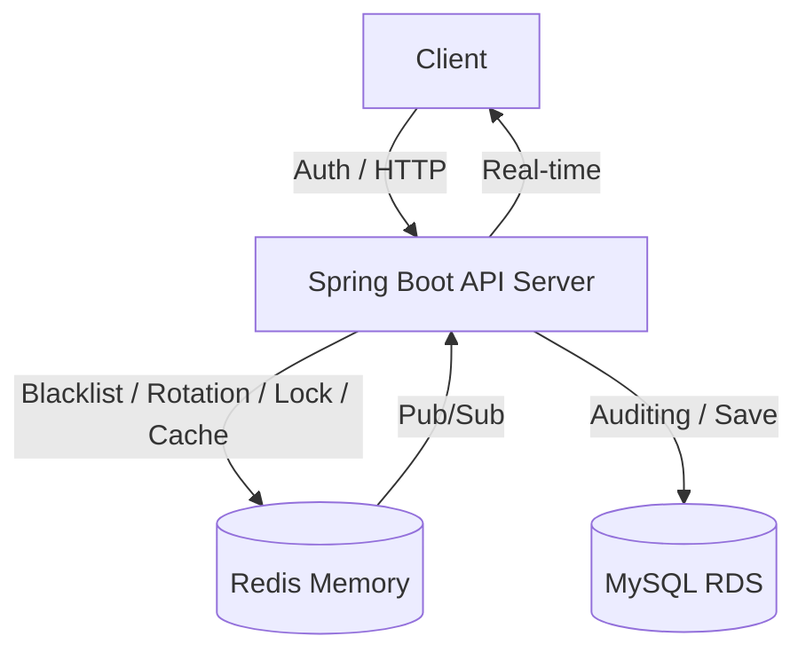

# 🔮 Tarot Insight (타로 인사이트)

> **"분산 환경의 실시간 통신, 고정밀 동시성 제어, 그리고 완벽한 데이터 정합성을 보장하는 타로 상담 플랫폼"**

**Tarot Insight**는 사용자와 타로 상담사를 실시간으로 연결하는 전문 상담 플랫폼입니다. 최신 **Spring Boot 4.0** 환경을 기반으로 하며, **Redisson 분산 락**, **Redis 캐싱**, 그리고 **JWT Refresh Token Rotation & Blacklist** 보안 체계를 결합하여 대규모 트래픽에서도 안정적이고 안전한 서비스를 제공합니다.

---

## 1. 🛠 핵심 기술적 성취 (Technical Focus)

본 프로젝트는 백엔드 설계의 핵심인 **실시간성, 확장성, 정합성, 그리고 보안**을 해결하는 데 집중했습니다.

* **고가용성 동시성 제어 (Redisson):** Redis 기반 분산 락을 구현하여 1:1 상담 예약의 중복 발생을 원천 차단. **100인 멀티쓰레드 테스트**를 통해 데이터 정합성 검증 완료.
* **성능 및 데이터 정합성 보장 (Cache-Aside & Evict):** 상담사 목록에 Redis 캐시를 적용하여 응답 속도를 극대화하고, 리뷰 작성 시 `@CacheEvict`를 통해 캐시와 DB 간의 100% 정합성 유지.
* **보안 고도화 (Refresh Token Rotation):** Access Token의 짧은 수명을 보완하기 위해 RTR(Rotation) 전략을 도입. 재발급 시마다 Refresh Token을 갱신하고 Redis와 대조하여 토큰 탈취 위험을 원천 봉쇄.
* **Stateless 보안 강화 (JWT Logout Blacklist):** 로그아웃된 토큰을 남은 유효시간 동안 Redis 블랙리스트에 저장하여 즉각적인 접근 차단 구현.
* **도메인 주도 설계 (DDD) 및 최적화:** 도메인별 패키지 분리 및 내부 Enum 독립화를 통해 유지보수성 향상. `BaseTimeEntity` 상속 구조로 전 엔티티의 JPA Auditing 통일.

---

## 2. 💻 Tech Stack

### Backend
* **Core:** Java 17, **Spring Boot 4.0.3**
* **Concurrency & Cache:** **Redisson (Distributed Lock)**, **Spring Cache (Redis)**, Spring @Async (ThreadPool)
* **Data:** Spring Data JPA, **QueryDSL (도입 예정)**, MySQL 8.0
* **Security:** Spring Security, **JWT (Access/Refresh with Rotation)**, BCrypt, Redis Blacklist
* **Docs:** Springdoc OpenAPI 3.0.2 (Swagger UI)

---

## 3. 🏗 System Architecture

---

## 4. 🚀 Core Features & Implementation

### 4.1 Redis 기반 JWT 보안 시스템
* **Refresh Token Rotation:** 로그인 시 Access/Refresh 토큰 동시 발급 및 Redis 저장. 재발급 요청 시 Redis 토큰 검증 후 두 토큰을 모두 갱신하여 보안성 강화.
* **TTL 기반 블랙리스트:** 로그아웃 시 토큰의 남은 수명만큼만 Redis에 보관하도록 설계하여 메모리 효율성 확보 및 입구 차단(Gatekeeper).

### 4.2 Redisson 분산 예약 및 리뷰 캐싱
* **Cache Eviction:** 상담사 평점이 변동되는 시점(리뷰 등록)에 실시간으로 캐시를 파기하여 사용자에게 항상 최신화된 데이터 제공.
* **Distributed Lock:** Facade 패턴을 활용하여 트랜잭션과 락의 생명주기를 분리. **Redisson Watchdog**을 활용해 작업 완료 시까지 락 유지 보장.

### 4.3 지능형 채팅 및 비동기 영속화
* **Async Persistence:** 메시지 전송과 DB 저장을 분리하여 채팅 지연(Latency) 최소화. `ThreadPoolTaskExecutor`를 통한 독립적 쓰레드 풀 관리.

---

## 5. 🚨 Troubleshooting (문제 해결 경험)

### 5.1 분산 락 환경에서의 트랜잭션 커밋 타이밍 이슈
* **Issue:** 100인 동시성 테스트 시 간헐적으로 중복 예약(2건 성공)이 발생하는 현상 확인.
* **Solution:** 락 해제 시점이 트랜잭션 커밋 시점보다 빨라 발생하는 'Race Condition' 분석. **Lease Time을 제거하여 Watchdog을 활성화**하고, 서비스 레이어에서 `flush()` 호출을 통해 락 해제 전 DB 반영을 강제하여 정합성 100% 확보.

### 5.2 Spring Boot 4.0 & Swagger Jackson 버전 충돌
* **Issue:** Spring Boot 4.0(Spring 7) 도입 시 기존 Springdoc 버전과 Jackson 3.x 간의 클래스 로딩 충돌 발생.
* **Solution:** 의존성 최적화 및 `springdoc-openapi 3.0.2` 마이그레이션을 통해 스웨거 정상 구동 확보.

### 5.3 Swagger DateTime 파싱 및 데이터 클렌징
* **Issue:** JSON 내 주석 및 초(seconds) 단위 미포함으로 인한 `DateTimeParseException` 발생.
* **Solution:** DTO 필드에 `@Schema` 및 `@JsonFormat` 적용으로 데이터 전송 정합성 해결.

---

## 6. 🗄 Database Design

* **공통 사항**: 모든 엔티티는 `BaseTimeEntity`를 상속받아 `created_at`, `updated_at` 관리
* **`users`**: 사용자 정보 및 권한(UserRole) 관리
* **`tarot_readers`**: 상담사 프로필 및 실시간 평점 관리
* **`consultation_reservation`**: 예약 상태 및 분산 락 관리
* **`review`**: 상담 서비스 품질 관리 및 캐시 무효화 트리거

---
*Last Updated: 2026.03.10*