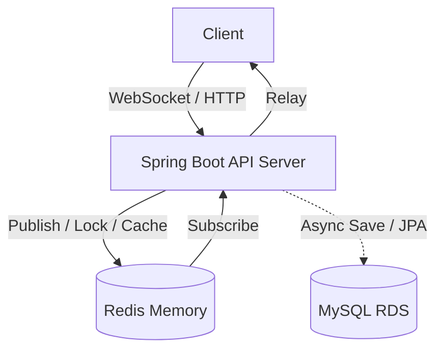

# 🔮 Tarot Insight (타로 인사이트)

> **"분산 환경의 실시간 통신, 고정밀 동시성 제어, 그리고 완벽한 데이터 정합성을 보장하는 타로 상담 플랫폼"**

**Tarot Insight**는 사용자와 타로 상담사를 실시간으로 연결하는 전문 상담 플랫폼입니다. 최신 **Spring Boot 4.0** 환경을 기반으로 하며, **Redisson 분산 락**을 통한 동시성 제어와 **Redis 기반의 실시간 캐싱/Pub-Sub 아키텍처**를 통해 대규모 트래픽에서도 안정적인 서비스를 제공합니다.

---

## 1. 🛠 핵심 기술적 성취 (Technical Focus)

본 프로젝트는 백엔드 설계의 핵심인 **실시간성, 확장성, 정합성, 그리고 객체지향적 구조 설계**를 해결하는 데 집중했습니다.

* **고가용성 동시성 제어 (Redisson):** Redis 기반 분산 락을 구현하여 1:1 상담 예약의 중복 발생을 원천 차단. **100인 동시 요청 테스트**를 통해 정합성 검증 완료.
* **성능 및 데이터 정합성 보장 (Cache-Aside & Evict):** 자주 조회되는 상담사 목록에 Redis 캐시를 적용하여 응답 속도를 극대화. 리뷰 작성 시 즉각적인 `@CacheEvict`를 트리거하여 캐시와 DB 간의 100% 데이터 정합성 유지.
* **비동기 성능 최적화 (Asynchronous):** 메시지 발송(Websocket)과 DB 저장 쓰레드를 분리. 사용자에게 즉각적인 응답을 제공하면서 무거운 I/O 작업은 백그라운드에서 처리.
* **도메인 주도 설계 및 엔티티 최적화 (DDD & JPA Auditing):** 도메인별 패키지 분리 및 내부 Enum의 독립적 추출을 통해 결합도를 낮추고, `BaseTimeEntity`를 활용한 공통 JPA Auditing 적용으로 데이터 추적성 완벽 보장.

---

## 2. 💻 Tech Stack

### Backend
* **Core:** Java 17, **Spring Boot 4.0.3**
* **Concurrency & Cache:** **Redisson (Distributed Lock)**, **Spring Cache (Redis)**, Spring @Async (ThreadPool)
* **Data:** Spring Data JPA, QueryDSL, MySQL 8.0
* **Real-time:** WebSocket, STOMP, Redis Pub/Sub
* **Security & Docs:** Spring Security, JWT, BCrypt, Springdoc OpenAPI 3.0.2

---

## 3. 🏗 System Architecture

---

## 4. 🚀 Core Features & Implementation

### 4.1 Redisson 기반 분산 예약 로직
* **Facade Pattern:** 서비스 로직과 락 로직을 분리. 트랜잭션 시작 전 락을 획득하고 커밋 후 해제하여 안정적인 동시성 제어 수행.

### 4.2 지능형 채팅 시스템
* **Persistence:** 휘발성 웹소켓 메시지를 MySQL에 실시간 영속화. 채팅방 입장 시 과거 내역을 로드하는 History API 제공.
* **Pub/Sub Bridge:** 다중 인스턴스 환경에서도 메시지 유실 방지를 위해 Redis 수신 컨테이너 수동 설정.

### 4.3 Redis 캐시 기반 성능 고도화
* **Cache Eviction Strategy:** 상담사 평점이 업데이트되는 리뷰 작성 로직에 캐시 무효화 전략을 도입하여 사용자에게 항상 최신화된 데이터를 제공.

---

## 5. 🚨 Troubleshooting (문제 해결 경험)

### 5.1 Spring Boot 4.0 & Swagger(Springdoc) Jackson 버전 충돌 해결
* **Issue:** Spring Boot 4.0(Spring 7) 도입 시 기존 Springdoc 2.x 버전과 Jackson 3.x 간의 `NoSuchFieldError: POJO` 충돌로 인한 스웨거 구동 실패.
* **Solution:** 강제적인 의존성 고정을 제거하고, Spring Boot 4.x 규격에 맞춘 `springdoc-openapi 3.0.2`로 마이그레이션하여 안전한 API 문서화 환경 복구.

### 5.2 JPA Auditing 데이터 누락 및 객체 강결합 분리
* **Issue:** 일부 데이터 영속화 시 `created_at` 필드가 NULL로 삽입되는 현상 및 클래스 내부에 Enum이 선언되어 DTO와 Entity 간 결합도가 높아지는 문제.
* **Solution:** `@EnableJpaAuditing` 활성화 및 `BaseTimeEntity`로 상속 구조를 단일화. 내부 Enum(MessageType, UserRole 등)을 독립된 Entity 패키지로 추출하여 객체지향적 책임 분리 원칙(SRP) 준수.

### 5.3 Swagger DateTime 파싱 오류 및 JSON 데이터 클렌징
* **Issue:** `DateTimeParseException` (index 10, index 16) 발생으로 인한 API 요청 실패.
* **Solution:** JSON 데이터 내 주석(//) 제거, ISO 포맷('T') 처리 및 초(seconds) 단위 규격 통일을 통해 Jackson 역직렬화 정합성 확보.

---

## 6. 🗄 Database Design

* **공통 사항**: 모든 엔티티는 `BaseTimeEntity`를 상속받아 `created_at`, `updated_at` 자동 관리
* **`chat_messages`**: 실시간 대화 데이터 영속화 및 타입 관리 (JPA Auditing 적용)
* **`consultation_reservation`**: 분산 락 키 및 낙관적 락 관리
* **`tarot_reader`**: 상담사 프로필 및 실시간 평점(캐시) 관리
* **`review`**: 상담사 평점 갱신 및 Cache Eviction 트리거

---
*Last Updated: 2026.03.10*